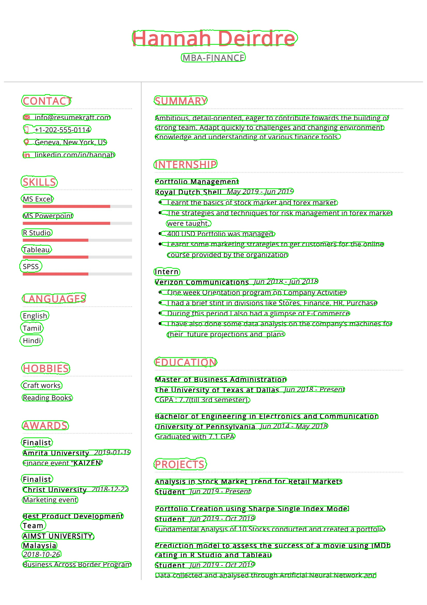
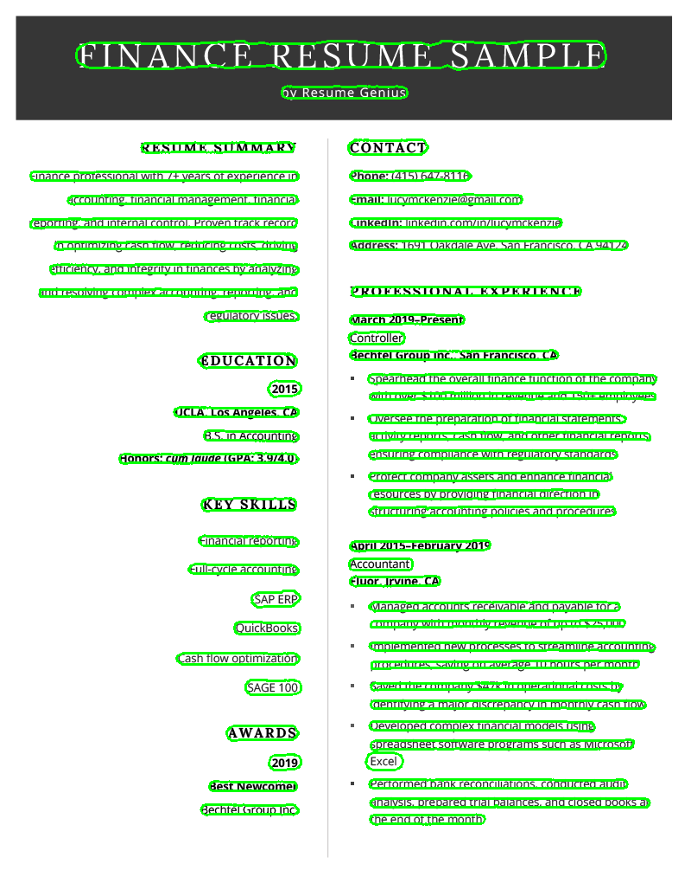
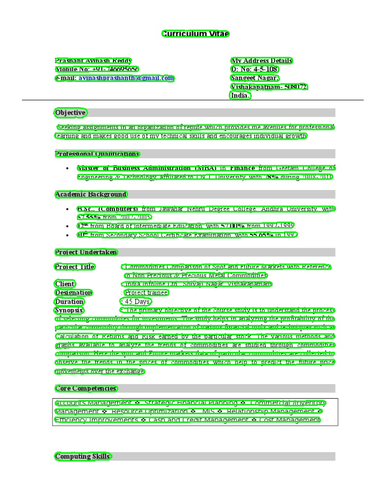

## Inference
```bash
python inference.py
```


## Train
```bash
python app.py
```


## Demo DBNet
#### input


#### output






# References
This is a tensorflow2.x implementation of "Real-time Scene Text Detection with Differentiable Binarization".
This project was inspired by or uses code from [zonasw](https://github.com/zonasw/DBNet). Thank you for their amazing work! 
